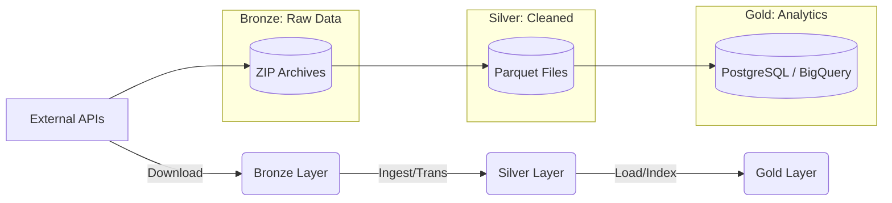

# Proyecto Energy Data Pipeline ⚡

Welcome to the **Energy Data Ecosystem**. This project implements a robust **Lakehouse Architecture** (Bronze/Silver/Gold) to ingest, process, and analyze Spanish Energy Market data from **ESIOS** (Red Eléctrica) and **OMIE**.

It is fully automated using **Apache Airflow** on **Docker**, ensuring production-grade reliability and cloud readiness (Google Cloud Platform compatible).

---

## 🏗️ Architecture

The system follows a 3-layer data flow:



### 1. Bronze Layer (Raw)
- **Source**: ESIOS API & OMIE Website.
- **Format**: Original `.zip` archives organized by `Year/Month`.
- **Retention**: Permanent (Source of Truth).

### 2. Silver Layer (Processed)
- **Format**: Optimized `.parquet` files.
- **Transformations**:
    - Encoding fixes (Latin-1 to UTF-8).
    - CSV Header/Footer resizing.
    - Type casting (String -> Float/Date).
    - Basic Validation.

### 3. Gold Layer (Database)
- **Technology**: PostgreSQL (Local/Container) or Google BigQuery.
- **Schema**:
    - `liquicomun`: Settlement data (LiquiComun).
    - `omie`: Market results (Marginal Prices, PDBF, PDVD).
- **Features**: Idempotent inserts (deduplication on PK), Optimized Indexes.

---

## 🚀 Getting Started

### Prerequisites
- **Docker Desktop** (must be running).
- **Git**.

### Installation & Run
The entire system is containerized. You do not need Python installed on your host machine.

1. **Clone & Setup**:
   ```bash
   git clone <repo-url>
   cd ProyectoWEB
   ```

2. **Launch Airflow**:
   ```bash
   docker-compose up -d --build
   ```
   *This commands builds the image and starts Airflow Scheduler, Webserver, and Postgres.*

3. **Access Control Panel**:
   - Open **[http://localhost:8080](http://localhost:8080)**
   - **User**: `admin`
   - **Password**: `admin`

4. **Activate Pipelines**:
   - Toggle **ON** the DAGs `esios_liquicomun_pipeline` and `omie_pipeline`.

---

## ⚙️ Automation (Airflow DAGs)

### `esios_liquicomun_pipeline` (Daily @ 08:00)
1. **Source**: ESIOS
2. **Tasks**:
   - `download_bronze`: Fetches `liq_prdvdatos`, `liq_enRRqh`, etc.
   - `ingest_silver`: Extracts & converts to Parquet.
   - `process_gold`: Loads into DB `liquicomun` schema.

### `omie_pipeline` (Daily @ 08:30)
1. **Source**: OMIE
2. **Tasks**: Parallel execution for:
   - `pdbc` (Programa Diario Base Casación)
   - `pdbf` (Programa Diario Base Funcionamiento)
   - `pdvd` (Programa Diario Viabilidad)
   - `marginalpdbc` / `marginalpibc` (Precios Marginales)

---

## 📂 Project Structure

```text
ProyectoWEB/
├── dags/                   # Airflow Automation Workflows
│   ├── esios_dag.py
│   └── omie_dag.py
├── src/                    # Core Logic
│   ├── bronze/             # Downloaders (Requests/Client)
│   ├── silver/             # Parsers & Parquet Converters
│   ├── common/             # Utils (DB Manager, FileSystem)
│   └── config/             # Settings (URLs, Schemas)
├── Dockerfile              # Python Environment Definition
├── docker-compose.yaml     # Service Orchestration
└── requirements.txt        # Python Dependencies
```

---

## ☁️ Cloud Roadmap (GCP)
This project is designed for **Google Cloud Platform**:
- **Compute**: Airflow on Docker can be deployed to **Cloud Run** or formatted for **Cloud Composer**.
- **Storage**: `local_data/` volume can be mounted to **GCS (Google Cloud Storage)** buckets.
- **Database**: `DatabaseManager` is ready to switch connection string to **BigQuery** or **Cloud SQL**.

---

*Verified by Data Architect - Jan 2026*
